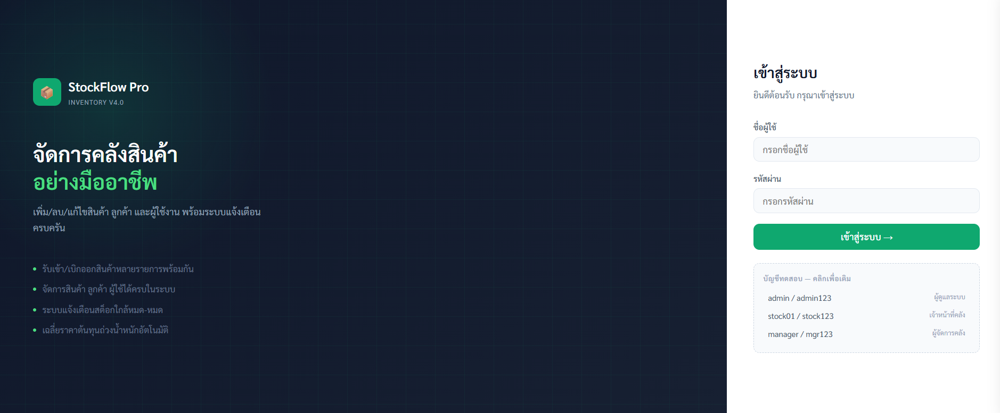
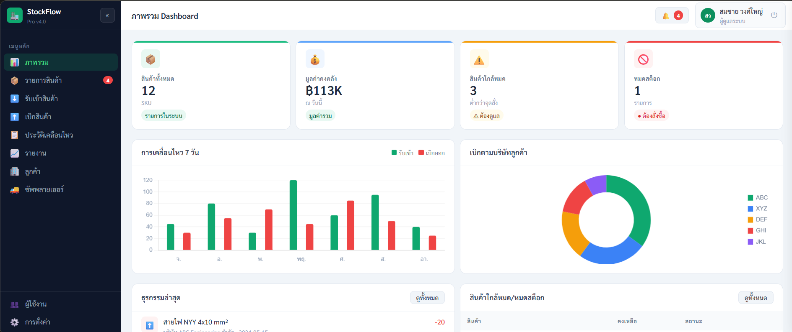
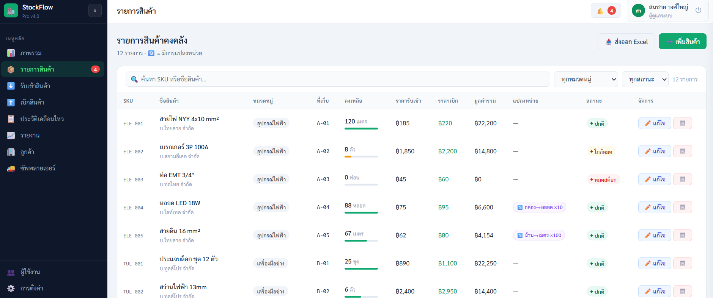
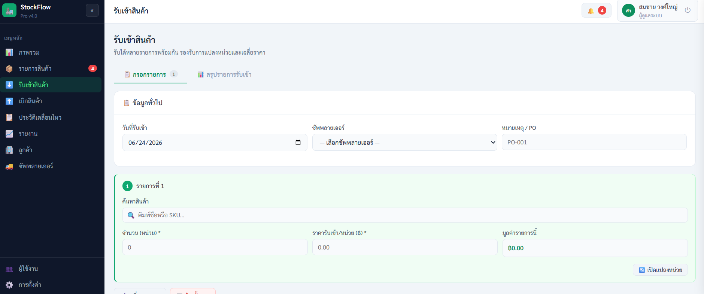
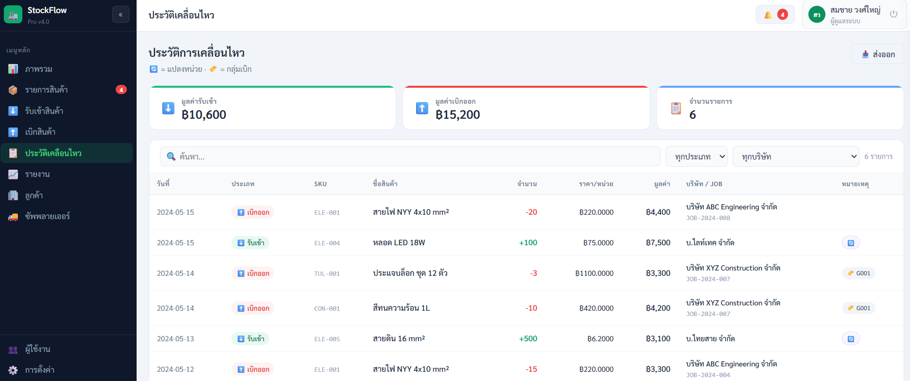
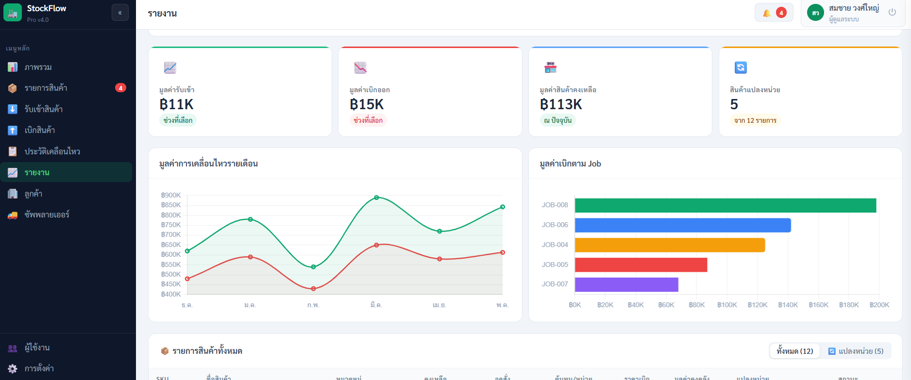

# BEST Management System - MongoDB Version

ระบบจัดการขายและค่าใช้จ่ายที่เก็บข้อมูลใน MongoDB และรันบน Server

## Screenshots








## การติดตั้งบน Ubuntu 24.04 (Proxmox)

### 1. อัปเดตระบบ

```bash
sudo apt update && sudo apt upgrade -y
```

### 2. ติดตั้ง Node.js 18.x

```bash
curl -fsSL https://deb.nodesource.com/setup_18.x | sudo -E bash -
sudo apt install -y nodejs
node -v
npm -v
```

### 3. ติดตั้ง MongoDB

```bash
# Import MongoDB public GPG key
curl -fsSL https://www.mongodb.org/static/pgp/server-7.0.asc | sudo gpg -o /usr/share/keyrings/mongodb-server-7.0.gpg --dearmor

# Add MongoDB repository
echo "deb [ arch=amd64,arm64 signed-by=/usr/share/keyrings/mongodb-server-7.0.gpg ] https://repo.mongodb.org/apt/ubuntu jammy/mongodb-org/7.0 multiverse" | sudo tee /etc/apt/sources.list.d/mongodb-org-7.0.list

# Install MongoDB
sudo apt update
sudo apt install -y mongodb-org

# Start MongoDB
sudo systemctl start mongod
sudo systemctl enable mongod
sudo systemctl status mongod
```

### 4. ติดตั้ง PM2 (สำหรับ Process Management)

```bash
sudo npm install -g pm2
```

### 5. อัปโหลดไฟล์ไปยัง Server

Upload โฟลเดอร์ทั้งหมดไปยัง Server (ใช้ SCP, SFTP หรือ Git)

```bash
# ตัวอย่างการใช้ SCP
scp -r /path/to/JOB user@your-server-ip:/home/user/
```

### 6. ติดตั้ง Dependencies

```bash
cd /home/user/JOB
npm install --production
```

### 7. ตั้งค่า Environment Variables

สร้างไฟล์ `.env`:

```bash
nano .env
```

ใส่ค่าต่อไปนี้:
```
PORT=5000
MONGODB_URI=mongodb://localhost:27017/best_db
JWT_SECRET=your_strong_random_secret_key_change_this
NODE_ENV=production
```

บันทึกและออก (Ctrl+X, Y, Enter)

### 8. Seed ข้อมูลเริ่มต้น

```bash
node seed.js
```

### 9. เริ่ม Server ด้วย PM2

```bash
pm2 start server.js --name best-app
pm2 save
pm2 startup
```

### 10. ตั้งค่า Firewall (ถ้าจำเป็น)

```bash
sudo ufw allow 5000/tcp
sudo ufw allow 22/tcp
sudo ufw enable
```

### 11. ทดสอบการเข้าถึง

เปิดเบราว์เซอร์และเข้าไปที่:
```
http://your-server-ip:5000
```

## โครงสร้างโปรเจกต์

```
JOB/
├── server.js              # Main server file
├── package.json           # Dependencies
├── .env                   # Environment variables
├── seed.js                # Seed initial data to MongoDB
├── config/
│   └── db.js             # MongoDB connection
├── models/               # MongoDB Schemas
│   ├── User.js
│   ├── Sale.js
│   ├── Expense.js
│   ├── Payment.js
│   ├── Customer.js
│   ├── Category.js
│   ├── ActivityLog.js
│   └── DeleteRequest.js
├── routes/               # API Routes
│   ├── auth.js
│   ├── users.js
│   ├── sales.js
│   ├── expenses.js
│   ├── payments.js
│   ├── customers.js
│   ├── categories.js
│   ├── logs.js
│   └── delreqs.js
├── middleware/
│   └── auth.js           # JWT Authentication
├── public/
│   └── index.html        # Frontend HTML
├── BEST.js               # React Frontend
└── api.js                # API Client (optional)
```

## การติดตั้ง

### 1. ติดตั้ง Dependencies

```bash
npm install
```

### 2. ตั้งค่า MongoDB

ตรวจสอบว่า MongoDB ได้รันอยู่แล้ว หรือใช้ MongoDB Atlas

แก้ไข `.env`:
```
MONGODB_URI=mongodb://localhost:27017/best_db
JWT_SECRET=your_secret_key_here
PORT=5000
```

### 3. Seed ข้อมูลเริ่มต้น

```bash
node seed.js
```

### 4. เริ่ม Server

**Development:**
```bash
npm run dev
```

**Production:**
```bash
npm start
```

Server จะรันที่ `http://localhost:5000`

## API Endpoints

### Authentication
- `POST /api/auth/login` - Login
- `GET /api/auth/me` - Get current user

### Users (Admin only)
- `GET /api/users` - Get all users
- `POST /api/users` - Create user
- `PUT /api/users/:id` - Update user
- `DELETE /api/users/:id` - Delete user

### Sales
- `GET /api/sales` - Get all sales
- `POST /api/sales` - Create sale
- `PUT /api/sales/:id` - Update sale
- `DELETE /api/sales/:id` - Delete sale

### Expenses
- `GET /api/expenses` - Get all expenses
- `POST /api/expenses` - Create expense
- `PUT /api/expenses/:id` - Update expense
- `DELETE /api/expenses/:id` - Delete expense

### Payments
- `GET /api/payments` - Get all payments
- `POST /api/payments` - Create payment
- `PUT /api/payments/:id` - Update payment
- `DELETE /api/payments/:id` - Delete payment

### Customers
- `GET /api/customers` - Get all customers
- `POST /api/customers` - Create customer
- `PUT /api/customers/:id` - Update customer
- `DELETE /api/customers/:id` - Delete customer

### Categories
- `GET /api/categories?type=sale|expense|payment` - Get categories by type
- `POST /api/categories` - Create category
- `PUT /api/categories/:id` - Update category
- `DELETE /api/categories/:id` - Delete category

### Activity Logs
- `GET /api/logs` - Get all logs
- `POST /api/logs` - Create log

### Delete Requests
- `GET /api/delreqs` - Get all delete requests
- `POST /api/delreqs` - Create delete request
- `PUT /api/delreqs/:id` - Update delete request (approve/reject)
- `DELETE /api/delreqs/:id` - Delete delete request

## User Roles

- **admin** - เข้าถึงทุกฟีเจอร์
- **manager** - จัดการข้อมูล อนุมัติการลบ
- **user** - เพิ่ม/แก้ไขข้อมูล ดู Activity Log
- **viewer** - ดูข้อมูลเท่านั้น

## Default Users

- **admin** / admin123
- **manager** / manager123
- **user** / user123
- **viewer** / viewer123

## การจัดการ Server ด้วย PM2

### ดูสถานะ Process

```bash
pm2 status
pm2 logs best-app
pm2 stop best-app
pm2 restart best-app
pm2 delete best-app
```

### ตั้งค่า Nginx (Optional - สำหรับ Reverse Proxy)

ติดตั้ง Nginx:
```bash
sudo apt install -y nginx
```

สร้าง config file:
```bash
sudo nano /etc/nginx/sites-available/best-app
```

ใส่ค่าต่อไปนี้:
```nginx
server {
    listen 80;
    server_name your-domain.com;

    location / {
        proxy_pass http://localhost:5000;
        proxy_http_version 1.1;
        proxy_set_header Upgrade $http_upgrade;
        proxy_set_header Connection 'upgrade';
        proxy_set_header Host $host;
        proxy_cache_bypass $http_upgrade;
    }
}
```

เปิดใช้งาน:
```bash
sudo ln -s /etc/nginx/sites-available/best-app /etc/nginx/sites-enabled/
sudo nginx -t
sudo systemctl restart nginx
```

## สิ่งที่ต้องแก้ต่อ

Frontend (BEST.js) ยังไม่ได้แก้ไข CRUD operations ใน components ต่างๆ ให้เรียก API ทั้งหมด ปัจจุบันแก้ไขเฉพาะ:
- Login
- Load data เมื่อเริ่มต้น
- Activity Log

ต้องแก้ไขเพิ่มเติม:
- SalesTab - Create/Update/Delete sales
- ExpensesTab - Create/Update/Delete expenses
- PaymentsTab - Create/Update/Delete payments
- CustomersTab - Create/Update/Delete customers
- ManageTab - Create/Update/Delete categories
- UsersTab - Create/Update/Delete users
- Delete Request handling

## License

MIT
